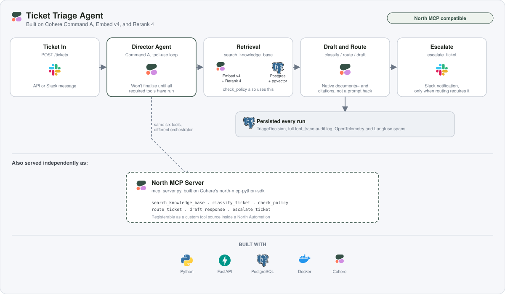
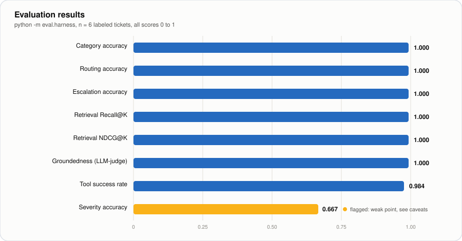
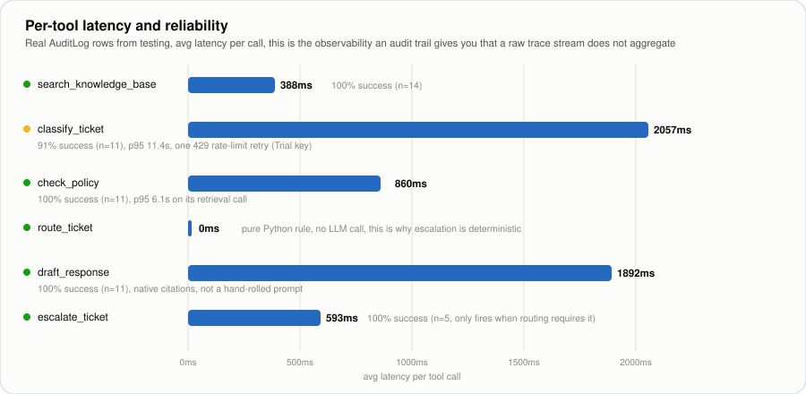

# Ticket Triage Agent

A support-ticket triage agent built on Cohere's Command A, Embed v4, and Rerank 4, and, separately, a real [North](https://cohere.com/north) MCP tool server exposing the same capabilities so they can be registered as external actions inside a North Automation.



## What this actually is

Most "AI agent" demos wire an LLM to a couple of functions and call it done. This project treats two things as first-class, tested properties instead of assumptions:

1. **Tool-use completion isn't guaranteed.** Command A will sometimes stop mid-procedure after one tool call instead of finishing the classify → route → draft → escalate sequence. The director loop ([app/agent/director.py](app/agent/director.py)) tracks which required tools have actually run and refuses to accept a final answer until they have.
2. **Grounding isn't automatic.** An early version of this agent copied a *past* resolved ticket's resolution ("we forced a password reset, confirmed no compromise") into a *new* customer's reply, describing actions that had never happened for them. The fix: use Cohere's native `documents=`/`citations` grounded-generation API instead of hand-stuffing context into a prompt, plus an explicit instruction that retrieved tickets are precedent, not a record of completed work. Also added an automated LLM-judge groundedness check in the eval harness so this class of bug is caught by a metric, not by luck.

Both were real bugs, caught by actually running tickets through the system, not hypothetical.

## Architecture

```
Ticket in (API / Slack)
        │
        ▼
  Director Agent (Command A, multi-step tool-use loop)
        │  won't finalize until required tools have run
        ├─ search_knowledge_base   (Embed v4 vector search → Rerank 4)
        ├─ classify_ticket         (severity + category)
        ├─ check_policy            (SLA / runbook lookup)
        ├─ route_ticket            (category+severity → team)
        ├─ draft_response          (Cohere native grounded generation + citations)
        └─ escalate_ticket         (Slack notification)
        │
        ▼
  TriageDecision persisted (Postgres) + full tool_trace audit log + OTel/Langfuse spans
```

The same six tools are also served independently as a **North MCP server** ([mcp_server.py](mcp_server.py)), see below.

## What's actually Cohere, what's ours

| Layer | What it is |
|---|---|
| Command A (tool-use, classification, drafting) | Real Cohere API calls |
| Embed v4 (`input_type=search_document`/`search_query`) | Real Cohere API calls |
| Rerank 4 | Real Cohere API calls |
| Native grounded generation (`documents=`, `citations`) | Real Cohere chat-API feature, not a hand-rolled RAG prompt |
| FastAPI app, Postgres/pgvector schema, director loop, Slack webhook, tracing, eval harness | Custom code, built to use the above |
| `north_automation.py`'s `WorkflowOrchestrator` | A stand-in for a real North Automation (no North access to test against) |
| `mcp_server.py` | **Not** a stand-in. A real MCP server built on Cohere's own [`north-mcp-python-sdk`](https://github.com/cohere-ai/north-mcp-python-sdk), speaking the actual protocol North uses to call external tools |

## Using this as a North feature

[mcp_server.py](mcp_server.py) exposes `search_knowledge_base`, `classify_ticket`, `check_policy`, `route_ticket`, `draft_response`, and `escalate_ticket` as MCP tools over `streamable-http`, using `NorthMCPServer` from Cohere's own SDK. This means North's own agent, not our hand-rolled director, can be the orchestrator, calling these tools directly as registered actions.

```bash
python mcp_server.py
# Starting Ticket Triage North MCP server on port 5222...
```

`search_knowledge_base` results carry a `_north_metadata` field (`renderer: "document"`, `content`, `title`, `meta`) so retrieved documents render as real citation cards in North's UI, per North's own tool-result convention.

Verified locally end-to-end with the SDK's own MCP client (session init, auth token, `tools/list`, `tools/call`). Confirmed all six tools register correctly and `search_knowledge_base` round-trips through the real Postgres/pgvector + Rerank 4 pipeline and returns correctly-shaped results.

Auth: North sends an `X-North-ID-Token` header; set `NORTH_MCP_TRUSTED_ISSUERS` (comma-separated identity-provider issuer URLs) before registering this server with a real North workspace so tokens are signature-verified, not just decoded. Left unset here since there's no North access to test signature verification against.

## Evaluation results

Run via `python -m eval.harness` against the 6-case labeled dataset in [eval/dataset.py](eval/dataset.py):



| Metric | Result |
|---|---|
| Category accuracy / F1 (macro) | 1.000 / 1.000 |
| Routing accuracy | 1.000 |
| Escalation accuracy | 1.000 |
| Retrieval Recall@K | 1.000 |
| Retrieval NDCG@K | 1.000 |
| Groundedness (LLM-judge, 0–1) | 1.000 |
| Severity accuracy / F1 (macro) | 0.667 / 0.583 |
| Tool success rate | 0.984 |
| Latency (mean / p95) | 44.3s / 114.9s |

The chart above is the "does it work" story. The one below is the "why this matters for North" story, pulled straight from real `AuditLog` rows, not synthetic numbers, showing exactly where latency and failure risk concentrate per tool. This is the kind of aggregated, queryable view a raw OpenTelemetry trace stream doesn't hand you on its own, and it's the same audit trail underlying the reliability argument at the top of this README: the two Cohere reasoning calls (`classify_ticket`, `check_policy`'s retrieval) carry all the latency variance and the one observed failure, while `route_ticket` is pure Python and therefore exactly 0ms and 100% deterministic, which is also the answer to "is escalation random": it isn't, only the classification feeding it has any variance.



Honest caveats, not hidden ones:
- **6 cases is a small sample**, enough to sanity-check the pipeline and catch gross regressions, not enough to trust the numbers to two decimal places. Expanding the labeled set is the natural next step before treating these as real benchmarks.
- **Severity is the weak point.** The model's misses were plausible-but-wrong judgment calls on borderline cases (e.g., "suspicious login attempts, locked out" classified P2-high against a labeled P1-critical), the same ambiguity a human triager would face, not a nonsense error.
- **Latency and the one tool failure are both explained by a Cohere Trial API key** (20 calls/minute). The single failed tool call was a 429; the high p95 is `tenacity`'s exponential backoff retrying through rate limits. A production key would materially change both numbers, since they measure the key tier, not the architecture.
- Retrieval and groundedness hitting 1.000 reflects the small, clean labeled set (one obviously-relevant seeded doc per case) more than it proves generalization. Worth stress-testing with harder/ambiguous cases.

## Running it

```bash
docker compose up -d                    # Postgres + pgvector
alembic upgrade head                    # schema
python -m scripts.seed_data             # sample KB docs/runbooks/tickets, embedded via Cohere
uvicorn app.main:app --reload           # API on :8000
python mcp_server.py                    # North MCP server on :5222 (separate process)
python -m eval.harness                  # evaluation report
pytest                                  # unit tests (Cohere client mocked, no API key needed)
```

Required env var: `COHERE_API_KEY`. Everything else in `.env.example` (Langfuse, OTel endpoint, Slack, North webhook, North MCP trusted issuers) is optional. The app runs with sane defaults and stubs when unset.

## Project structure

```
app/
  agent/          director loop, taxonomy, prompts
  tools/          the six tools, typed, independently callable, tested
  cohere_client/  thin async wrapper: embed / rerank / chat, retried + traced
  retrieval/      pgvector ingestion + search
  integrations/   Slack webhook stub, WorkflowOrchestrator (North Automations stand-in)
  observability/  OpenTelemetry + Langfuse
  api/            FastAPI routes
mcp_server.py     real North MCP server (see above)
eval/             labeled dataset, metrics, harness
scripts/          seed data
tests/            unit tests
```
